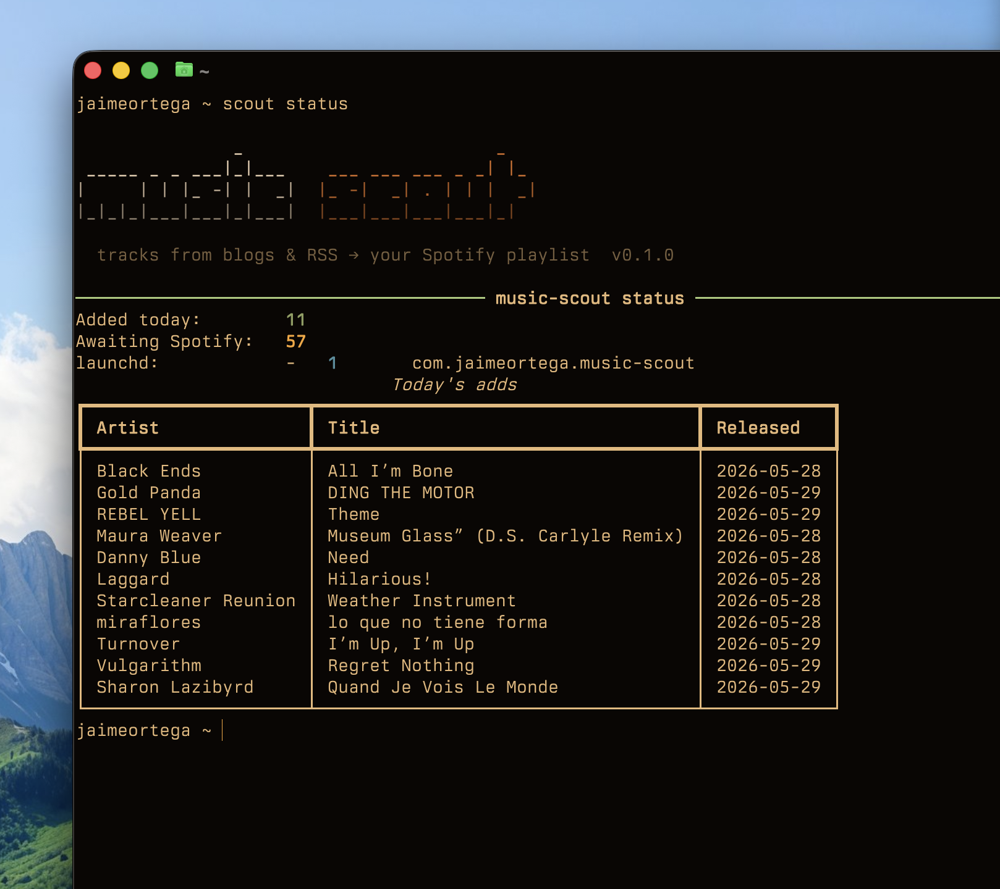

<p align="center">
  
</p>

# music-scout

I love music blogs. Copying their recommendations into a playlist so I can actually listen to them all together is a pain in the ass, so I built **music-scout** to do it for me.

Once a day it reads the blogs, finds each song on Spotify, and adds this year's releases to one playlist, newest first. It logs every track it has seen, so nothing gets added twice and songs Spotify doesn't have yet get another look tomorrow.



## What it pulls from

- **RSS feeds** — any music blog with a feed.
- **Hype Machine** — its popular page (their RSS is dead, so we scrape the page).
- **Spotify playlists** — point it at an editorial playlist and it'll mine that too.

It keeps only tracks released this year; older ones are logged and skipped. Tracks Spotify doesn't have yet get another search every day until they show up.

## Setup

```bash
git clone https://github.com/JaimeOrtegaxyz/music-scout ~/Documents/GitHub/music-scout
cd ~/Documents/GitHub/music-scout
./install.sh               # makes the `scout` command, runs from any directory
scout init
```

`install.sh` needs only `python3` >= 3.11. It creates `.venv/` in the repo, editable-installs the package, and symlinks `scout` into `~/.local/bin`. Safe to re-run after every `git pull`. `--ai` adds the optional LLM-recipe extra. If `~/.local/bin` isn't on your `PATH`, the script prints the line to add to `~/.zshrc`.

> The install is **editable** on purpose: the app keeps config, the SQLite track DB and logs in `./data` inside the checkout, so it has to run from there. Your blogs and listening history sit next to the code but stay **out of git**; only the `*.example.yaml` templates are committed. Anyone who clones it starts clean with their own `scout init`.

To remove it: `scout schedule uninstall` (stop the daily job), then `rm ~/.local/bin/scout` and `rm -rf .venv`.

`init` walks you through Spotify auth, linking an existing playlist (paste its URL) or creating one, adding sources, and installing the daily job. Every step after auth is skippable, so a second checkout doesn't spawn a duplicate playlist. Answers land in `data/config.yaml` and `data/sources.yaml`; edit them by hand whenever.

Spotify changed the rules in Feb 2026: writing to a playlist now needs your own **Developer App** and a **Premium** account. `init` tells you exactly what to click.

## Messy feeds

Every blog titles its posts differently: `Artist - Song`, `Stream: Artist – Song`, `Artist『Song』を公開`, or the truly cursed ones where the title is "EP REVIEW" and the actual song is buried in the post body. One regex can't cover all of them.

So when you *add* a feed, music-scout can ask an LLM once to write a small regex recipe for it and save it into `sources.yaml`. The daily run replays that regex; it never calls a model, so a run costs nothing.

```bash
scout sources add https://someblog.com/feed   # auto-writes a recipe if it can
scout sources fix someblog                     # redo one
scout sources fix --all                         # retrofit them all
```

It uses your `ANTHROPIC_API_KEY` if set (`pip install -e '.[ai]'`), else the `claude` CLI if you have it, else a generic parser. Without either, you fix the weird ones by hand. If a feed turns out to be reviews with no song titles in it, it says so and skips the recipe.

## Listening

[cliamp](https://github.com/bjarneo/cliamp) is a terminal player that speaks Spotify. Run it and pick the **Music Scout** playlist from its browser. There's no `scout listen` because cliamp is interactive and can't be handed tracks from outside, but it shares the same Spotify app, so it works as soon as `init` is done.

## Commands

```bash
scout run                       # one full pass (what the daily job runs)
scout backfill --source <id>    # page back through a feed's archive for this year's misses
scout status                    # today's adds + how many are still missing
scout verify                    # was the last daily run healthy? exit 0/1/2
scout retry                     # re-check the not-on-Spotify pile
scout sources list              # see your feeds
scout sources fix --all         # refresh parse recipes
scout schedule uninstall        # stop the daily job
```

## How it works

```
sources → resolve on Spotify → keep this year's → add to the playlist
   └────────────────── every step logged to data/state.sqlite ──────────────────┘
```

That SQLite file is the whole trick. It sits between "found a song" and "put it in Spotify." A failed search waits and gets retried tomorrow; an already-added track is skipped.

launchd runs it daily at 09:00. Nothing stays resident between runs, and the only account involved is your own Spotify login. To run at a different time, change `Hour`/`Minute` in `music_scout/scheduler.py` and re-run `scout schedule install`.

## License

MIT. It's a playlist filler, take it.

<p align="center">
  <picture>
    <source media="(prefers-color-scheme: dark)" srcset="psych-music-icon-white.svg">
    
  </picture>
</p>
